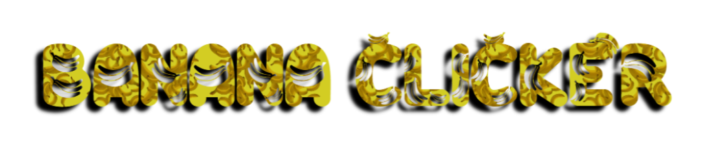

<p align="center">
  
</p>

<p align="center">
  <strong>Un click.</strong><br>
  <strong>Una banana.</strong><br>
  <strong>Una cantidad absurdamente grande de clicks.</strong>
</p>

<p align="center">
  🍌 Click • ⚡ Evoluciona • 🌎 Compite • 👑 Llega al Boss
</p>

---

## 🍌 ¿Qué es Banana Clicker?

**Banana Clicker** es un pequeño juego web basado en una idea extremadamente sencilla:

> **Haz click en una banana.**

Pero, como cualquier proyecto que empieza con una banana, las cosas rápidamente se salen de control.

Cada click aumenta tu contador, desbloquea nuevas formas de banana y te acerca a evoluciones cada vez más absurdas.

Y sí...

**hay una banana final boss.**

---

# 🎮 Características

### 🍌 Sistema de clicks

Haz click sobre la banana para conseguir clicks.

Cada click incluye:

* Animación de impacto
* Sonido de click
* Partículas
* Número flotante `+1`
* Animación de la banana
* Actualización instantánea del contador

---

### 💾 Progreso guardado

Tu progreso se guarda automáticamente mediante:

```text
localStorage
```

Esto significa que tus clicks y tu nivel permanecen guardados en tu navegador.

Puedes cerrar la página y volver después.

Tus bananas seguirán ahí.

---

### 🌎 Global Clicks

Banana Clicker también tiene un contador compartido entre todos los jugadores.

```text
🍌 Tus clicks:     15,284

🌎 Global clicks:  928,421
```

Cada click realizado por cualquier visitante puede contribuir al contador global.

El sistema utiliza:

* Netlify Functions
* Netlify Blobs
* ETags
* Actualizaciones seguras ante múltiples clicks simultáneos

Por lo tanto, el contador no depende del `localStorage` de cada usuario.

**Todos comparten el mismo contador.**

---

# 🧬 Evoluciones

A medida que consigues clicks, tu banana cambia.

Actualmente existen múltiples etapas de evolución, incluyendo:

|  Clicks | Evolución                |
| ------: | ------------------------ |
|       0 | 🍌 Banana normal         |
|     500 | 😈 Banana Evil           |
|   1,000 | 🟢 Banana Slimin         |
|   1,500 | 🍌 Bananini              |
|   2,000 | 🧑‍💼 Vendedor de banana |
|   3,000 | 🎩 EL Banana             |
|   4,000 | 👤 Banana Addiel         |
|   5,000 | 🟢 Bananini Slimininini  |
|   6,000 | 🌴 Banananza             |
|   7,000 | ❓ Bananeado              |
|   8,500 | 👩 Baneen a Ana          |
|  10,000 | 😈 Bananini Evilini      |
|  15,000 | ⚠️ BA-NA-NA              |
|  25,000 | 🤖 Banana Chat GPT       |
|  40,000 | 🧬 Triptofano            |
|  60,000 | 💀 SkeleNana             |
|  78,000 | 👻 Bantasma              |
| 100,000 | 🍌 Platano               |
| 150,000 | 👑 Final Boss Banana     |

### 👑 Final Boss

A los **150,000 clicks** aparece:

> **FINAL BOSS BANANA**

Y sí.

Tiene su propio efecto especial.

---

# ✨ Un click nunca es simplemente un click

Cuando haces click, pueden ocurrir varias cosas simultáneamente:

```text
       +1
       ↑
       │
   💥 BANANA 💥
    ↙  ↓  ↘
   ✨  ✨  ✨
```

El juego genera partículas, números flotantes y efectos visuales para que cada click tenga respuesta inmediata.

---

# 🎵 Música y sonidos

Banana Clicker utiliza diferentes sonidos para sus eventos:

```text
click.mp3
evolve.mp3
event_plus5.mp3
boss.mp3
secret.mp3
explode.mp3
```

Los sonidos se utilizan para:

* 🍌 Clicks
* 🧬 Evoluciones
* ⭐ Eventos especiales
* 👑 Boss
* 🔮 Secretos
* 💥 Efectos

---

# ⭐ Evento +5

Cada **50 clicks**, ocurre un pequeño evento:

```text
+5
```

El jugador recibe cinco clicks adicionales.

Esto hace que:

```text
49 → 50 → +5 → 55
```

El click físico sigue contando como **un solo click global**, mientras que el bonus afecta al progreso local del jugador.

---

# 🌊 Fondo animado

Banana Clicker no utiliza simplemente un fondo estático.

El fondo contiene:

* 🌊 Ondas animadas
* ✨ Partículas flotantes
* 💫 Iluminación dinámica
* 🖱️ Interacción con el mouse
* 🌌 Movimiento constante
* 🎨 Variaciones de luz

Todo se genera mediante **Canvas + JavaScript**.

---

# 🖱️ Interacción con el mouse

La banana responde ligeramente al movimiento del cursor.

El objetivo es que parezca que la banana está dentro de un espacio vivo en lugar de ser simplemente una imagen colocada en el centro de la pantalla.

---

# 📱 Diseño responsive

Banana Clicker está diseñado para funcionar también en dispositivos móviles.

El diseño se adapta a:

* 💻 PC
* 🖥️ Monitores grandes
* 📱 Teléfonos
* 📲 Pantallas pequeñas

La interfaz evita depender de tamaños fijos para que la banana siga siendo accesible.

---

# 🛠️ Tecnologías

Banana Clicker está construido principalmente utilizando tecnologías web estándar.

### Frontend

```text
HTML5
CSS3
JavaScript
Canvas API
Web Audio
LocalStorage
```

### Backend

```text
Netlify Functions
Netlify Blobs
```

### Hosting

```text
Netlify
```

### Código

```text
JavaScript Vanilla
```

No se utiliza un framework pesado para el juego principal.

---


---

# 🌎 ¿Cómo funciona el contador global?

El contador personal funciona localmente:

```javascript
localStorage
```

Pero el contador global utiliza una Function:

```text
Jugador
   │
   │ click
   ▼
Banana Clicker
   │
   ▼
Netlify Function
   │
   ▼
Netlify Blobs
   │
   ▼
🌎 Global Click Counter
```

Cuando otro jugador hace click:

```text
Jugador A ──┐
            │
Jugador B ──┼──► 🌎 Global Clicks
            │
Jugador C ──┘
```

Todos contribuyen al mismo contador.

---

# 🚀 Ejecutar el proyecto

## Opción 1 — Netlify

Banana Clicker está pensado para desplegarse fácilmente en Netlify.

El proyecto debe incluir la carpeta:

```text
netlify/functions/
```

para que la Function del contador global pueda ejecutarse.

---

## Opción 2 — Desarrollo local

Para trabajar en el frontend puedes abrir:

```text
index.html
```

directamente en el navegador.

Sin embargo, para probar correctamente el contador global necesitas ejecutar el proyecto mediante el entorno de Netlify, ya que las Functions no son simples archivos JavaScript del navegador.

---

# 🔧 Desarrollo

Si quieres modificar Banana Clicker:

### Cambiar una banana

Edita la lista:

```javascript
const levels = [
    ...
];
```

Cada nivel contiene:

```javascript
{
    name: "Nombre",
    need: 5000,
    img: "banana.png"
}
```

---

### Añadir una nueva evolución

Por ejemplo:

```javascript
{
    name: "MEGA BANANA",
    need: 200000,
    img: "mega_banana.png"
}
```

Después coloca:

```text
assets/mega_banana.png
```

---

# 🧠 Filosofía del proyecto

Banana Clicker nació de una idea simple y terminó convirtiéndose en algo mucho más grande.

No busca ser el clicker más complejo del mundo.

Busca ser:

> **Un juego pequeño, absurdo y divertido.**

La gracia está en ver hasta dónde puede llegar una idea tan simple como:

```text
🍌 + 🖱️ = CLICK
```

---

# 🐛 ¿Encontraste un bug?

Si encuentras algún problema:

* El contador no aumenta
* Una banana no aparece
* Un sonido no funciona
* El contador global falla
* Una evolución no se desbloquea
* Algo explota inexplicablemente

...probablemente sea culpa de la banana.

Pero puedes abrir un **Issue** igualmente. 🍌

---

# 📜 Licencia

Este proyecto puede utilizarse como proyecto personal y experimental.

Los assets, sonidos y código pueden tener condiciones de uso independientes dependiendo de su origen.

Consulta los archivos correspondientes antes de redistribuir contenido del proyecto.

---

# 🍌 Banana Statistics

```text
Bananas:        MANY
Clicks:         ∞
Global clicks:  🌎
Bosses:         1
Cordura:        0%
```

---

# 💛 Créditos

### Banana Clicker

Creado por **Addiel**.

Un pequeño proyecto hecho para experimentar con:

* Desarrollo web
* JavaScript
* Animaciones
* Audio
* Canvas
* LocalStorage
* Netlify Functions
* Almacenamiento global

Y, obviamente...

**bananas.**

---

<p align="center">

## 🍌 KEEP CLICKING 🍌

<strong>How many clicks can humanity make?</strong>

<br><br>

`Click. Evolve. Repeat.`

</p>
